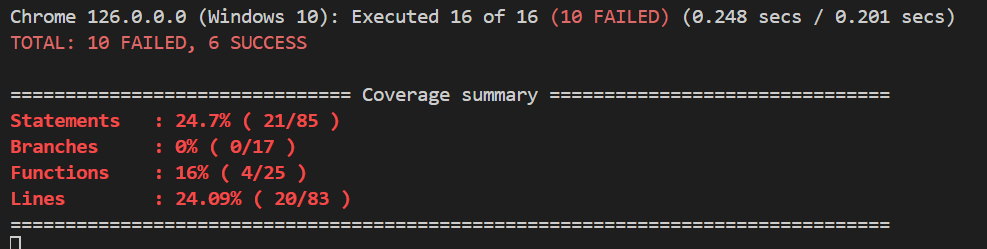

## fitness-dashboard
A single page page angular application for fitness tracking

# Code Coverage

We are trying to test for 

Component Creation: Ensure the component is created successfully.

Form Initialization: Verify that the form is initialized with default values.

Add Workout on Submission: Test if a new workout is added when the form is valid.

Handle Invalid Form Submission: Ensure that no workout is added when the form is invalid.

Save Button Click: Check if the saveForm method is called when the save button is clicked.

Back Button Click: Verify that navigation happens correctly when the back button is clicked.

Calculate Total Workout Minutes: Test if the total workout minutes are calculated correctly.

Handle Empty Month Selection: Ensure the component handles an empty month selection gracefully.

Handle Form Change: Verify that the onChange method updates the month and the filtered workouts correctly.

Return Empty Array for Unknown Month: Check that an empty array is returned for unknown months.

Code coverage is measured using Karma and Istanbul. The following table shows the code coverage results for the project:
